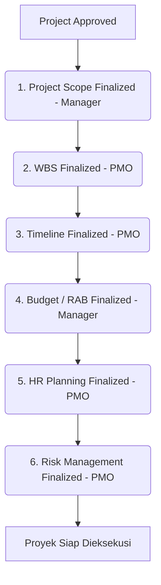

# Dokumentasi Hak Akses Pengguna (Role-Based Access Control)
## Sistem Manajemen Proyek Kolaboratif (KelolalN)

Dokumen ini menjelaskan pembagian peran (role), hak akses (permissions), alur kerja (workflow), serta pembatasan dependen (constraints) antar-modul yang diterapkan di dalam aplikasi.

---

## 1. Daftar Peran (Roles) Sistem
Terdapat 3 (tiga) peran utama di dalam sistem ini:
1. **Project Manager (PM)**: Penanggung jawab proyek di lapangan yang mengajukan inisiasi proyek dan memantau jalannya proyek miliknya sendiri.
2. **Manager**: Pimpinan atau pengambil keputusan (decision-maker) tingkat atas yang menyetujui inisiasi proyek, menyusun proposal/piagam, serta mengendalikan anggaran proyek.
3. **Project Management Officer (PMO)**: Perencana dan pengendali proyek yang merinci struktur kerja (WBS), jadwal (Timeline), alokasi SDM, serta rencana risiko.

---

## 2. Matriks Hak Akses Modul
Berikut adalah rangkuman hak akses untuk masing-masing peran di setiap modul utama:

| Modul / Fitur | Project Manager (PM) | Manager | PMO |
| :--- | :---: | :---: | :---: |
| **Inisiasi Proyek (Project)** | Buat Proyek, Edit Proyek Milik Sendiri, Hapus Draft | Setujui / Tolak Proyek, Ubah Status ke Planning | Lihat Proyek (Hanya saat status `planning`) |
| **Proposal & Project Charter** | Baca (Milik Sendiri) | CRUD (Draf), Generate AI, Finalisasi (`submitted`) | Baca (Hanya saat status proyek `planning`) |
| **Project Scope** | Baca (Milik Sendiri) | CRUD & Finalisasi (`finalized`) | Baca |
| **WBS (Work Breakdown Structure)** | Baca (Milik Sendiri) | Baca | CRUD & Finalisasi (`finalized`) |
| **Timeline & Gantt Chart** | Baca (Milik Sendiri) | Baca | CRUD & Finalisasi (`finalized`) |
| **Budget Planning (RAB)** | Tidak Ada Akses (403) | CRUD & Finalisasi (`finalized`) | Baca |
| **Human Resource (HR) Planning** | Tidak Ada Akses (403) | Baca | CRUD & Finalisasi (`finalized`) |
| **Risk Management** | Tidak Ada Akses (403) | Baca | CRUD, Generate AI, & Finalisasi (`finalized`) |

*Keterangan:*
* **CRUD**: Create, Read, Update, Delete.
* **Baca**: Hak akses hanya untuk melihat detail data (Read-Only) tanpa kemampuan mengubah.
* **Tidak Ada Akses (403)**: Dihalang oleh middleware sistem (menghasilkan halaman error 403 Forbidden).

---

## 3. Detail Wewenang & Batasan Peran

### A. Peran: Project Manager (PM)
* **Inisiasi Proyek**:
  - Dapat membuat draf proyek baru (`status => draft`).
  - Mengubah informasi proyek miliknya selama proyek masih dalam status `draft` atau ditolak (`rejected`).
  - Mengajukan proyek ke Manager untuk dinilai (`status => submitted`).
  - Menghapus proyek miliknya apabila statusnya masih `draft`.
  - Hanya dapat melihat daftar proyek yang dia buat (isolasi data antar-PM).
* **Perencanaan Proyek**:
  - Memiliki akses **Read-Only** pada modul **Proposal**, **Project Charter**, **Project Scope**, **WBS**, dan **Timeline** khusus untuk proyek miliknya yang telah disetujui.
  - Sama sekali tidak memiliki akses ke modul **Budgeting (RAB)**, **HR Planning**, dan **Risk Management**.

### B. Peran: Manager
* **Inisiasi Proyek**:
  - Menilai pengajuan proyek dari PM: menyetujui (`approved`) atau menolak (`rejected`).
  - Mengubah status proyek dari `approved` ke `planning` setelah Proposal & Project Charter diselesaikan.
  - Dapat melihat seluruh daftar proyek di dalam sistem dari semua PM.
* **Proposal & Project Charter**:
  - Bertanggung jawab penuh menyusun Proposal & Project Charter proyek yang disetujui.
  - Dapat meminta bantuan AI (OpenRouter API) untuk menghasilkan draf analisis secara otomatis.
  - Melakukan finalisasi Proposal & Charter (`status => submitted`) agar proyek dapat berlanjut ke tahap perencanaan.
* **Perencanaan Proyek**:
  - Pengendali penuh atas **Project Scope** (CRUD & Finalisasi).
  - Pengendali penuh atas **Budget Planning / RAB** (CRUD & Finalisasi).
  - Hanya memiliki hak akses **Read-Only** untuk **WBS**, **Timeline**, **HR Planning**, dan **Risk Management**.

### C. Peran: Project Management Officer (PMO)
* **Inisiasi Proyek**:
  - Hanya dapat melihat proyek yang sudah berada dalam status `planning`. Tidak dapat melihat proyek yang masih berstatus `draft`, `submitted`, `approved`, atau `rejected`.
* **Proposal & Charter**:
  - Hanya memiliki akses **Read-Only** pada Proposal & Charter proyek yang sedang di-plan.
* **Perencanaan Proyek**:
  - Pengendali penuh atas **WBS / Work Breakdown Structure** (CRUD & Finalisasi).
  - Pengendali penuh atas **Timeline & Gantt Chart** (CRUD & Finalisasi).
  - Pengendali penuh atas **HR Planning / Perencanaan SDM** (CRUD & Finalisasi).
  - Pengendali penuh atas **Risk Management / Manajemen Risiko** (CRUD, Generate AI, & Finalisasi).

---

## 4. Konstrain Dependensi Alur Perencanaan (Predecessor Guards)
Sistem ini menggunakan pengaman alur kerja yang ketat. PMO atau Manager tidak dapat melompati langkah perencanaan tertentu sebelum modul sebelumnya difinalisasi (`finalized`):

*Contoh Penerapan Aturan:*
* Form/Aksi edit anggaran **Budget/RAB** hanya akan terbuka jika **Timeline** sudah berstatus `finalized`.
* Modul **HR Planning** tidak dapat diakses sebelum **Budget/RAB** selesai difinalisasi.
* Modul **Risk Management** terkunci hingga **HR Planning** diselesaikan.
* Proyek baru dianggap selesai tahap perencanaannya dan siap dieksekusi setelah rencana risiko berhasil difinalisasi.

---

## 5. Keamanan & Imutabilitas Data (Data Lock)
Setelah suatu perencanaan difinalisasi (`finalized` atau `submitted`):
1. Seluruh tombol tambah, edit, hapus, dan simpan draf akan disembunyikan secara otomatis pada antarmuka pengguna (UI).
2. Di sisi backend, request menuju endpoint modifikasi data (POST/PUT/DELETE) akan ditolak dan dibatalkan menggunakan Laravel Policies dan Middleware Checks untuk mencegah bypass melalui URL.
3. Rencana proyek menjadi arsip resmi yang tidak dapat diubah (immutable) selama masa eksekusi berjalan.
